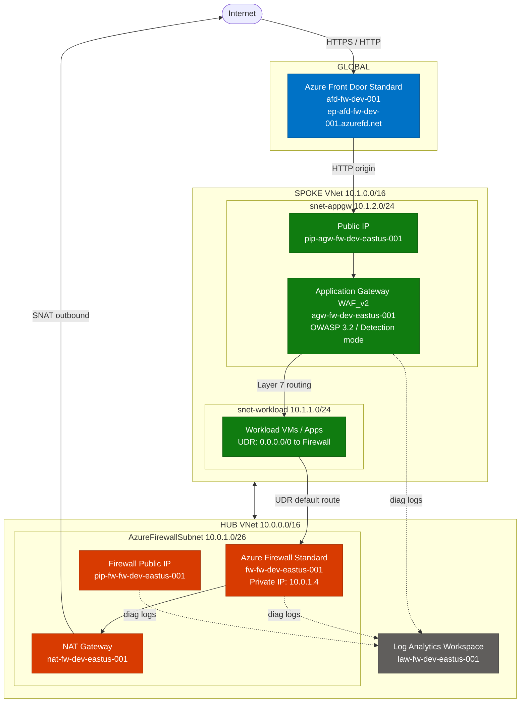

# Azure Firewall — AVM Terraform Deployment

Deploys an Azure Firewall environment using [Azure Verified Modules (AVM)](https://azure.github.io/Azure-Verified-Modules/) following the **flat file-per-resource** pattern recommended by the AVM team (see [avm-terraform-labs](https://github.com/Azure-Samples/avm-terraform-labs)).

## Architecture

This deployment implements a **Hub-and-Spoke** topology:

**Hub VNet**
- **Resource Group** — AVM resource group module
- **Log Analytics Workspace** — centralized diagnostics destination
- **Virtual Network** — AVM Hub VNet with dedicated `AzureFirewallSubnet`
- **Public IP** — Standard SKU, zone-redundant
- **Firewall Policy** — manages rule collections
- **Azure Firewall** — Standard/Premium tier with diagnostics enabled

**Spoke VNet**
- **Spoke Virtual Network** — AVM VNet peered to Hub via bidirectional VNet peering
- **Workload Subnet** — subnet with UDR forcing all egress traffic through the firewall
- **Route Table** — default route (`0.0.0.0/0`) pointing to Firewall private IP
- **NAT Gateway** — outbound connectivity for spoke workloads

**Firewall Rules**
- **Network Rule Collections** — L4 rules (DNS, NTP, custom)
- **Application Rule Collections** — L7 FQDN-based rules (web, updates)

## Project Structure

```
├── terraform.tf                        # Provider and version constraints
├── data.tf                             # Utility modules (regions)
├── variables.tf                        # Input variables with templatestring naming
├── locals.tf                           # Naming computation and diagnostic settings
├── main.tf                             # Random string and resource group
├── avm.log_analytics_workspace.tf      # Log Analytics Workspace AVM module
├── avm.virtual_network.tf              # Hub Virtual Network AVM module
├── avm.public_ip_address.tf            # Firewall Public IP AVM module
├── avm.firewall_policy.tf              # Firewall Policy AVM module
├── avm.firewall.tf                     # Azure Firewall AVM module
├── avm.nat_gateway.tf                  # NAT Gateway AVM module (spoke outbound)
├── avm.spoke_virtual_network.tf        # Spoke Virtual Network AVM module
├── spoke_route_table.tf                # UDR routing spoke traffic via firewall
├── firewall_rules.tf                   # Network & application rule collections
├── outputs.tf                          # Grouped output maps
├── terraform.tfvars.example            # Example variable values
└── README.md
```

## Naming Convention

Resource names are generated using Terraform's `templatestring()` function with configurable segments:

| Segment       | Default | Description                        |
|---------------|---------|------------------------------------|
| `workload`    | `fw`    | Short workload identifier          |
| `environment` | `dev`   | Environment (dev, tst, prd, etc.)  |
| `location`    | —       | Azure region (from `var.location`) |
| `sequence`    | `001`   | Sequence number (zero-padded)      |

Override any name template via the `resource_name_templates` variable.

## Prerequisites

- Azure subscription with appropriate permissions
- Terraform ~> 1.10 installed
- Azure CLI (optional, for authentication)

## Module Sources

| Module | Version |
|--------|---------|
| [Resource Group](https://registry.terraform.io/modules/Azure/avm-res-resources-resourcegroup/azurerm/latest) | 0.2.1 |
| [Log Analytics Workspace](https://registry.terraform.io/modules/Azure/avm-res-operationalinsights-workspace/azurerm/latest) | 0.4.2 |
| [Virtual Network](https://registry.terraform.io/modules/Azure/avm-res-network-virtualnetwork/azurerm/latest) | 0.16.0 |
| [Public IP Address](https://registry.terraform.io/modules/Azure/avm-res-network-publicipaddress/azurerm/latest) | 0.2.0 |
| [Firewall Policy](https://registry.terraform.io/modules/Azure/avm-res-network-firewallpolicy/azurerm/latest) | 0.2.3 |
| [Azure Firewall](https://registry.terraform.io/modules/Azure/avm-res-network-azurefirewall/azurerm/latest) | 0.4.0 |
| [Regions Utility](https://registry.terraform.io/modules/Azure/avm-utl-regions/azurerm/latest) | 0.5.0 |
| [NAT Gateway](https://registry.terraform.io/modules/Azure/avm-res-network-natgateway/azurerm/latest) | 0.3.2 |

## Quick Start

```bash
cp terraform.tfvars.example terraform.tfvars
# Edit terraform.tfvars with your values

terraform init
terraform plan
terraform apply
terraform output
```

## Configuration

### Required Variables

All variables have sensible defaults. The following are commonly customized:

| Variable | Description | Default |
|----------|-------------|---------|
| `location` | Azure region for deployment | `East US` |
| `firewall_sku_tier` | Firewall tier: Basic, Standard, or Premium | `Standard` |
| `vnet_address_space` | Virtual network address space | `["10.0.0.0/16"]` |
| `firewall_subnet_address_prefix` | Firewall subnet (min /26) | `["10.0.1.0/26"]` |

### Optional Customizations

- **Resource Names**: Set custom names or use auto-generated CAF-compliant names
- **Availability Zones**: Configure zone redundancy (default: zones 1, 2, 3)
- **Log Retention**: Adjust Log Analytics retention (30-730 days)
- **SNAT Ranges**: Configure private IP ranges for SNAT
- **Tags**: Apply organizational tags to all resources

See `variables.tf` for all available configuration options.

## Best Practices Implemented

✅ **Naming Conventions**: Uses Azure Naming module for CAF-compliant resource names  
✅ **Security**: Standard SKU public IP, zone-redundancy, firewall policy separation  
✅ **Monitoring**: Integrated Log Analytics with diagnostic settings  
✅ **Modularity**: Uses Azure Verified Modules for maintainability  
✅ **High Availability**: Zone-redundant deployment across availability zones  
✅ **Tagging**: Consistent resource tagging for governance  
✅ **Validation**: Input validation on critical parameters  
✅ **Documentation**: Comprehensive outputs for integration  

## Firewall SKU Comparison

| Feature | Basic | Standard | Premium |
|---------|-------|----------|---------|
| Threat Intelligence | Basic | Standard | Advanced |
| IDPS | ❌ | ❌ | ✅ |
| TLS Inspection | ❌ | ❌ | ✅ |
| URL Filtering | ❌ | ✅ | ✅ |
| Web Categories | ❌ | ✅ | ✅ |
| Max Throughput | 250 Mbps | 30 Gbps | 30 Gbps |

## Outputs

After deployment, the following outputs are available:

- Resource Group details (name, ID, location)
- Virtual Network details (name, ID)
- Azure Firewall details (ID, name, private IP, public IP)
- Firewall Policy details (ID, name)
- Log Analytics Workspace details (ID, name, workspace ID)

## Post-Deployment

After successful deployment:

1. **Configure Firewall Rules**: Add application and network rules to the firewall policy
2. **Route Tables**: Configure UDR to route traffic through the firewall
3. **Monitoring**: Access logs in Log Analytics workspace
4. **Azure Portal**: View resources at [Azure Portal](https://portal.azure.com)

## Monitoring and Logs

Diagnostic logs are automatically configured and sent to Log Analytics:

- **Application Rules**: Connection attempts and rule matches
- **Network Rules**: Traffic flow and rule evaluations
- **Threat Intelligence**: Detected threats and alerts
- **Metrics**: Throughput, connection count, rule processing

Access logs via:
- Azure Portal → Log Analytics Workspace → Logs
- Query language: KQL (Kusto Query Language)

## Cost Considerations

Azure Firewall costs include:

- **Deployment Charge**: Fixed hourly rate per SKU tier
- **Data Processing**: Per GB of data processed
- **Public IP**: Standard public IP address cost
- **Log Analytics**: Ingestion and retention costs

Use Azure Pricing Calculator for estimates: https://azure.microsoft.com/pricing/calculator/

## Cleanup

To remove all deployed resources:

```bash
terraform destroy -auto-approve
```

## Troubleshooting

### Common Issues

1. **Subnet size too small**: Firewall subnet requires minimum /26
2. **Name conflicts**: Use unique names or rely on auto-generated names
3. **Zone availability**: Ensure your region supports availability zones
4. **Quota limits**: Verify subscription quotas for public IPs and firewalls

### Support

For issues with:
- **Terraform**: [HashiCorp Terraform Documentation](https://www.terraform.io/docs)
- **Azure Firewall**: [Azure Firewall Documentation](https://docs.microsoft.com/azure/firewall/)
- **AVM Modules**: [Azure Verified Modules GitHub](https://github.com/Azure/terraform-azurerm-avm-res-network-azurefirewall)

## Security Considerations

- Review and configure appropriate firewall rules before production use
- Enable threat intelligence in Premium SKU for enhanced security
- Implement least-privilege access using Azure RBAC
- Regular review of firewall logs and alerts
- Consider using Azure Policy for governance

## Contributing

To extend this configuration:

1. Add firewall rules via the firewall policy module
2. Configure additional diagnostic destinations (Storage, Event Hub)
3. Implement custom RBAC roles
4. Add management locks for production resources

## License

This project is licensed under the [MIT License](LICENSE). Azure Verified Modules (AVM) used in this project follow their respective licenses as published by Microsoft.

## References

- [Azure Firewall Documentation](https://docs.microsoft.com/azure/firewall/)
- [Azure Firewall Best Practices](https://docs.microsoft.com/azure/firewall/firewall-best-practices)
- [Terraform Azure Provider](https://registry.terraform.io/providers/hashicorp/azurerm/latest/docs)
- [Azure Verified Modules](https://aka.ms/avm)
- [Terraform Style Guide](https://developer.hashicorp.com/terraform/language/style)


## Architecture


